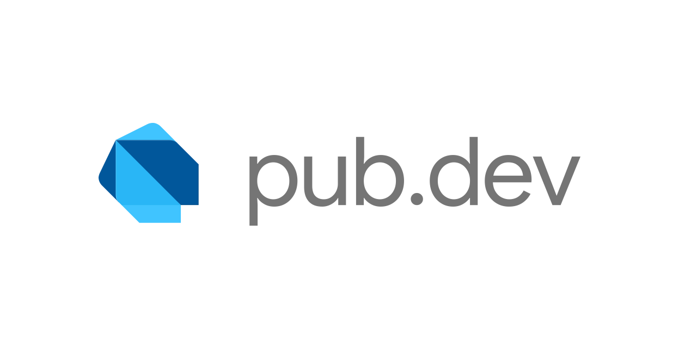

---

## ✨ Badges


---

> ⚠️ **Project Status: In Development**
>
> This project is still under active development.  
> Features, structure, and dependencies may change frequently until a stable release is published.  
> Contributions and feedback are always welcome!

---

# 📦 Pub.dev Explorer

**Pub.dev Explorer** is a high-performance, feature-rich mobile application designed for Dart and Flutter developers. It provides a seamless interface to explore, search, and track packages from the official [pub.dev](https://pub.dev) repository directly from your mobile device.

Built with **Clean Architecture 🏗️** and the **BLoC pattern 🧩**, the app ensures maintainability, scalability, and a smooth user experience. It leverages the latest Flutter technologies to provide real-time updates, secure local storage, and a premium design that mimics the official pub.dev experience while adding mobile-specific enhancements.

Whether you're looking for the newest trending packages or checking the health of your existing dependencies, Pub.dev Explorer is your ultimate companion. ✨

---

## 📑 Table of Contents

- [🎯 Key Features](#-key-features)
- [✨ Badges](#-badges)
- [🚀 Getting Started](#-getting-started)
- [🏗️ Project Architecture](#️-project-architecture)
- [📦 Dependencies Used](#-dependencies-used)
- [🎨 UI Kit / Design System](#-ui-kit--design-system)
- [🛠️ Contributions](#️-contributions)
- [📜 License](#-license)

---

## 🎯 Key Features

### 🔍 Package Discovery

- **Smart Search** - Quickly find any package on pub.dev with an optimized search interface.
- **Trending & New** - Stay updated with the latest and most popular packages in the ecosystem.
- **Detailed Package Info** - View full READMEs, scores, versions, and dependencies with high-fidelity rendering.

### 🔔 Notifications & Tracking

- **New Package Alerts** - Receive FCM push notifications when new exciting packages are released 🔔.
- **Dependency Health** - Monitor the health and scores of your favorite packages directly in the app.

### 🎨 User Experience & Design

- **Modern & Premium UI** - A polished design language that feels native to both Android and iOS 💎.
- **Responsive Layout** - Adapts perfectly to various screen sizes using `flutter_screenutil` 📱.
- **Offline First** - Basic caching of package details for quick access without internet 🗄️.
- **Interactive Markdown** - Full support for package READMEs with syntax highlighting and clickable links.

---

## 🏗️ Project Architecture

This project follows **Clean Architecture** principles to ensure a highly scalable, maintainable, and testable codebase.

### 1. 📂 Presentation Layer

- **Widgets & Pages**: Pure UI components built with Flutter.
- **BLoC / Cubit**: Handles state management and interacts with Domain usecases.
- **Routing**: Managed via `go_router` for declarative navigation.

### 2. 🧠 Domain Layer (Pure Dart)

- **Entities**: Core data models.
- **Use Cases**: Specific business logic units.
- **Repositories (Interfaces)**: Defines contracts for data operations.

### 3. 💾 Data Layer

- **Repositories (Implementations)**: Connects the domain to the data sources.
- **Data Sources**: Handles API calls (via `dio` & `pub_api_client`) and local storage (`shared_preferences`).
- **Models**: DTOs for JSON serialization.

### 🧩 Folder Structure

```text
lib/
├── core/                  # Shared utilities, themes, DI, and routes
├── features/              # Modular features
│   ├── home/              # Hero section, trending packages
│   ├── search/            # Advanced search functionality
│   └── package_detail/    # Full package analysis and README
└── main.dart              # Entry point
```

---

## 🚀 Getting Started

To run this app locally:

```bash
git clone https://github.com/AmrSalahDev/pub_dev_app.git
cd pub_dev_app
flutter pub get
flutter run
```

### ✅ Prerequisites

- 🐦 Flutter SDK ^3.11.0
- 🎯 Dart SDK ^3.11.0
- 📱 Android Studio / Xcode

---

## 📦 Dependencies Used

### 🏗️ Architecture & State Management

- `flutter_bloc` - Predictable state management 🧩.
- `get_it` & `injectable` - Service locator and dependency injection 💉.
- `go_router` - Declarative routing 🛣️.
- `equatable` - Simplify object equality ⚖️.

### 🌐 Networking & Data

- `pub_api_client` - Official pub.dev API client 📦.
- `dio` - Powerful HTTP client for auxiliary requests 📡.
- `firebase_messaging` - Real-time push notifications 🔔.
- `shared_preferences` - Local persistent storage 💾.

### 🎨 UI & UX

- `flutter_screenutil` - Responsive design scaling 📱.
- `markdown_widget` - High-quality README rendering 📖.
- `flutter_svg` - Vector asset support 🖼️.
- `shimmer` - Premium loading states ✨.
- `toastification` - Sleek user notifications 🔔.
- `talker` - Advanced logging and debugging tool 📝.

---

## ⭐ Star History

If you like this project, please give it a star ⭐

[](https://star-history.com/#AmrSalahDev/pub_dev_app&Date)

---

## 📜 License

⚖️ This project is licensed under the MIT License - see the LICENSE file for details.

---

<p align="center">
  <strong>Built with ❤️ using Flutter for the Developer Community</strong>
</p>
